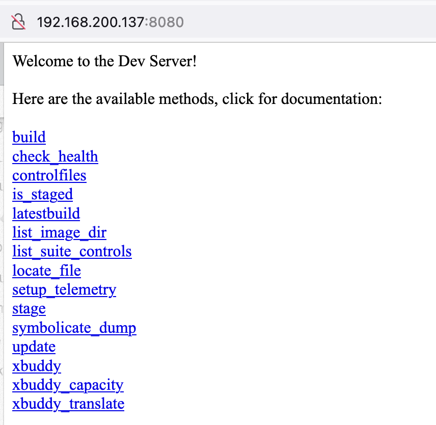

# Intro

This article will describe how to compile Chromium OS.

In this article, `(outside)` mean you need run command outside the `cros_sdk`, `(inside)` mean that you need run command in `cros_sdk`.

## 0: Prepare

1. Use Linux:
   - Distro: Follow the Chromium OS compilation guide, preferably Ubuntu 18.04, my choice is 18.04.6 LTS;
   - Spec: 16G+ memory, 200G+ disk.
2. Connect to network:
    Make sure your network can access Google, I have configured a proxy client on the router, and the entire subnet under the router can access the Internet smoothly.

## 1: Get the Chromium OS code and start building

### Install dependencies

``` shell
# (outside)
sudo apt-get install git gitk git-gui curl lvm2 xz-utils python3-pkg-resources python3-virtualenv python3-oauth2client python3.6 vim
```

Use `python3 --version` to confirm that the version of python3 is greater than 3.6. If it is less than 3.6, please refer to the following commands to switch to the version of python3.6 (and above).

``` shell
# (outside)
sudo update-alternatives --install /usr/bin/python3 python3 /usr/bin/python3.5 1
sudo update-alternatives --install /usr/bin/python3 python3 /usr/bin/python3.6 2
sudo update-alternatives --config python3
```

### Configure git

``` shell
# (outside)
git config --global user.name your_name
git config --global user.email your_email
```

### Configure Google API keys

Many features of chromiumOS require the use of api keys. How to apply can follow the [Acquiring Keys](https://www.chromium.org/developers/how-tos/api-keys/) chapter.

Write key to `~/.googleapikeys` like this:
```
google_api_key = "your_api_key"
google_default_client_id = "your_client_id"
google_default_client_secret = "your_client_secret"
```

### Install depot_tools

``` shell
# (outside)
git clone https://chromium.googlesource.com/chromium/tools/depot_tools.git
```
add `export PATH=/path/to/depot_tools:$PATH` to `~/.bashrc`


### Start cros_sdk

* This step will take you around 3-5 hours

1. Enter chromiumos workdir

``` shell
# (outside)
source ~/.bashrc # load PATH env
mkdir -p ~/chromiumos # create chromiumos work directory
cd ~/chromiumos # enter chromiumos dir
```

2. `repo init` with [release-R96-14268.B](https://chromium.googlesource.com/chromiumos/manifest.git/+/refs/heads/release-R96-14268.B) branch

``` shell
# (outside)
repo init -u https://chromium.googlesource.com/chromiumos/manifest.git --repo-url https://chromium.googlesource.com/external/repo.git -b release-R96-14268.B # repo init with release-R96-14268.B branch
repo sync -j4 # repo sync first, better with j4
repo sync -j16  # sync again
cros_sdk # This is the same command used to create the chroot, but if the chroot already exists, it will just enter.
```

`repo sync` will download about 20G of code.

`cros_sdk` or `cros_sdk --download` will use Google's prebuild sdk, you can also use `cros_sdk --bootstrap` to build it from source.

### Build all package

1. Setup `BOARD`, use `amd64-generic` here

``` shell
# (inside)
export BOARD=amd64-generic
setup_board --board=${BOARD}
```

2. Build all packages
``` shell
# (inside)
./build_packages --board=${BOARD}
```

3. Build test image

``` shell
# (inside)
./build_image --board=${BOARD} --noenable_rootfs_verification test
```

4. Install kvm and check kvm is ok.

``` shell
# (outside)
sudo apt-get install qemu-kvm
sudo kvm-ok
```

5. Convert test image to vm image

``` shell
# (inside)
./image_to_vm.sh --board=${BOARD} --test_image
```

6. Start vm

``` shell
# (inside)
cros_vm --start --image-path=../build/images/${BOARD}/latest/chromiumos_qemu_image.bin --board=${BOARD}
```

connect by ssh, test image's password is `test0000`: 
``` shell
# (outside)
ssh root@localhost -p 9222
```
 
connect by vnc:
``` shell
# (outside)
sudo apt-get install tigervnc-viewer
vncviewer localhost:5900
```

You can use `cros_vm --stop --board=${BOARD}` to stop vm.

## 2: Replace kernel to v5.10

### Check the current kernel

``` shell
# (inside)
cros_vm --start --image-path=../build/images/${BOARD}/latest/chromiumos_qemu_image.bin --board=${BOARD}
```

``` shell
# (outside)
ssh root@localhost -p 9222
```

```
localhost ~ # uname -a
Linux localhost 4.14.273-18374-gf939ed477069 #1 SMP PREEMPT Sat Mar 26 22:48:59 CST 2022 x86_64 Intel Xeon E312xx (Sandy Bridge) AuthenticAMD GNU/Linux
localhost ~ # uname -r
4.14.273-18374-gf939ed477069
localhost ~ # exit
```

``` shell
# (inside)
cros_vm --stop --board=${BOARD}
```

### Way 1: change virtual/linux-sources USE

`kernel-5_10` and `kernel-4_14` are in `virtual/linux-sources`'s USE, you can install 5.10 kernel by `virtual/linux-sources`.

``` shell
# (inside)
emerge-${BOARD} --unmerge chromeos-kernel-4_14
USE="kernel-5_10 -kernel-4_14" emerge-${BOARD} virtual/linux-sources
./build_packages --board=${BOARD}
./build_image --board=${BOARD} --noenable_rootfs_verification test
./image_to_vm.sh --board=${BOARD} --test_image
```

This method can only take effect temporarily, because the USE of 4.14kernel is used in the base profile, it will take effect on `linux-sources`, and `./build_packages --board=${BOARD}` will still switch back to the 4.14 kernel when rerun it, if you want to make it permanent, we can use method 2.

### Way 2: Define global USE

There is such a log when `./build_packages --board=${BOARD}`

```
02:05:44.250: INFO: Setting up portage in the sysroot.
02:05:44.879: INFO: Selecting profile: /mnt/host/source/src/overlays/overlay-amd64-generic/profiles/base for /build/amd64-generic
02:05:44.963: INFO: Updating toolchain.
```

We can see that the 4.14 kernel is defined from `/mnt/host/source/src/overlays/overlay-amd64-generic/profiles/base/make.defaults`

`USE="${USE} legacy_keyboard legacy_power_button sse kernel-4_14"`

We can define the USE in `make.conf` to override this USE

``` shell
# (inside)
vim /build/amd64-generic/etc/make.conf
```

``` diff
-USE=""
+USE="kernel-5_10 -kernel-4_14"
```

Rebuild package

``` shell
# (inside)
emerge-${BOARD} --unmerge chromeos-kernel-4_14
./build_packages --board=${BOARD}
./build_image --board=${BOARD} --noenable_rootfs_verification test
./image_to_vm.sh --board=${BOARD} --test_image
```

```
localhost ~ # uname -a
Linux localhost 5.10.108-12117-g4b3aa89a142d #1 SMP PREEMPT Mon Mar 28 00:35:07 CST 2022 x86_64 Intel Xeon E312xx (Sandy Bridge) AuthenticAMD GNU/Linux
localhost ~ # uname -r
5.10.108-12117-g4b3aa89a142d
localhost ~ # exit
```

### Way 3: use update_kernel.sh

``` shell
# (inside)
emerge-$BOARD --unmerge chromeos-kernel-4_14
emerage-$BOARD sys-kernel/chromeos-kernel-5_10
./update_kernel.sh  --remote=127.0.0.1 --ssh_port=9222
```

## 3: Deploy CrOS devserver

The dev server allows you to update your Chromium OS machine with new builds without having to copy them via a USB drive. It also serves as a static file repository, allowing you to install your own packages and scripts making it easy to customize your machine for development purposes.

### Deploy CrOS devserver to cros_sdk

``` shell
# (inside)
sudo start_devserver
```

Open http://localhost:8080/ !



### Deploy CrOS devserver to docker

Deploy to the docker is same as local, just need a cros docker image.

*This image should work well, but I haven't test it, download it is too slow.*

Dockerfile:
``` Dockerfile
FROM ubuntu:18.04
ENV DEBIAN_FRONTEND noninteractive
RUN apt-get update && apt-get -y install sudo git gitk git-gui curl lvm2 xz-utils python3-pkg-resources python3-virtualenv python3-oauth2client python3.6 vim
RUN useradd cros --create-home
RUN echo 'cros ALL=(ALL:ALL) NOPASSWD: ALL' >> /etc/sudoers
USER cros
RUN git clone https://chromium.googlesource.com/chromium/tools/depot_tools.git /home/cros/depot_tools
ENV PATH /home/cros/depot_tools:$PATH
RUN mkdir /home/cros/chromiumos
WORKDIR /home/cros/chromiumos
RUN repo init -u https://chromium.googlesource.com/chromiumos/manifest.git --repo-url https://chromium.googlesource.com/external/repo.git -b release-R96-14268.B
RUN repo sync
ENTRYPOINT ["/home/cros/depot_tools/cros_sdk"]
```

1. Build a base cros-sdk docker image

``` shell
# (outside)
docker build -t cros-sdk .
```

2. Build cros-sdk:board docker image, and mount static directory

``` shell
# (outside)
export BOARD=amd64-generic
docker run -d --privileged cros-sdk -- ./setup_board --board=$BOARD
ID=$(docker run -d --privileged cros-sdk -- ./setup_board --board=$BOARD)
docker logs -f ${ID}
docker wait ${ID}
docker commit ${ID} cros-sdk:$BOARD
ID=$(docker run -d --privileged cros-sdk -- ./build_packages --board=$BOARD --nowithtest --nowithautotest --nowithfactory)
docker logs -f ${ID}
docker wait ${ID}
docker commit ${ID} cros-sdk:$BOARD
docker run -d --volume static:/usr/lib64/devserver/static/:rw --privileged cros-sdk -- sudo start_devserver
```


## Problems and fixes

### Problem 1: chrome-icu build too slow

This step will also take you about 3 hours, most of the time is spent on downloading chromium-src, you can choose not to upgrade chrome-icu and chromeos-chrome.

- Check the installed version
``` shell
# (inside)
emerge-${BOARD} --ask chromeos-base/chrome-icu
```

```
Calculating dependencies... done!
[ebuild     U  ] chromeos-base/chrome-icu-96.0.4664.204_rc-r1 [96.0.4657.0_rc-r1] to /build/amd64-generic/
```

- Mask old version

``` shell
# (inside)
sudo su
echo ">=chromeos-base/chrome-icu-96.0.4657.0_rc-r1"  >> /build/amd64-generic/etc/portage/package.mask
echo ">=chromeos-base/chromeos-chrome-96.0.4657.0_rc-r1"  >> /build/amd64-generic/etc/portage/package.mask
exit
./build_packages --board=${BOARD}
```


### Problem 2: download source code failed

```
>>> 00:03:11 Failed to emerge chromeos-base/chromeos-lacros-96.0.4658.2-r1 for /build/amd64-generic/, Log file:
>>> 00:03:11   /build/amd64-generic/tmp/portage/logs/chromeos-base:chromeos-lacros-96.0.4658.2-r1:20220327-160305.log
>>> 00:03:11 === Start output for job chromeos-lacros-96.0.4658.2-r1 ===
chromeos-lacros-96.0.4658.2-r1:  * chromeos-lacros-squash-96.0.4658.2 BLAKE2B SHA512 size ;-) ...        [ ok ]
chromeos-lacros-96.0.4658.2-r1: >>> Downloading 'https://commondatastorage.googleapis.com/chromeos-localmirror/distfiles/chromeos-lacros-metadata-96.0.4658.2'
chromeos-lacros-96.0.4658.2-r1:   % Total    % Received % Xferd  Average Speed   Time    Time     Time  Current
chromeos-lacros-96.0.4658.2-r1:                                  Dload  Upload   Total   Spent    Left  Speed
  0     0    0     0    0     0      0      0 --:--:--  0:00:05 --:--:--     0
chromeos-lacros-96.0.4658.2-r1: curl: (35) OpenSSL SSL_connect: SSL_ERROR_SYSCALL in connection to commondatastorage.googleapis.com:443 
chromeos-lacros-96.0.4658.2-r1: >>> Downloading 'https://commondatastorage.googleapis.com/chromeos-mirror/gentoo/distfiles/chromeos-lacros-metadata-96.0.4658.2'
chromeos-lacros-96.0.4658.2-r1:   % Total    % Received % Xferd  Average Speed   Time    Time     Time  Current
chromeos-lacros-96.0.4658.2-r1:                                  Dload  Upload   Total   Spent    Left  Speed
  0   231    0     0    0     0      0      0 --:--:-- --:--:-- --:--:--     0
chromeos-lacros-96.0.4658.2-r1: curl: (22) The requested URL returned error: 404
chromeos-lacros-96.0.4658.2-r1: !!! Couldn't download 'chromeos-lacros-metadata-96.0.4658.2'. Aborting.
chromeos-lacros-96.0.4658.2-r1:  * Fetch failed for chromeos-base/chromeos-lacros-96.0.4658.2-r1, Log file:
chromeos-lacros-96.0.4658.2-r1:  *   /build/amd64-generic/tmp/portage/logs/chromeos-base:chromeos-lacros-96.0.4658.2-r1:20220327-160305.log
```

'https://commondatastorage.googleapis.com/chromeos-mirror/gentoo/distfiles/chromeos-lacros-metadata-96.0.4658.2' is empty, use `--buildpkg` to specify build it from source

``` shell
# (inside)
emerge-${BOARD} --ask --buildpkg chromeos-base/chromeos-lacros
```

### Problem 3: can't build image, latest output directory is invalid

```
03:23:46 INFO    : /mnt/host/source/chromite/bin/parallel_emerge --board=amd64-generic --root-deps=rdeps --usepkgonly -v --with-bdeps=n --root=/mnt/host/source/src/build/images/amd64-generic/R96-14268.79.2022_03_27_0323-a1/rootfs virtual/target-os
03:23:47.001: INFO: Running: emerge --usepkgonly '--with-bdeps=n' virtual/target-os --sysroot /build/amd64-generic --root /mnt/host/source/src/build/images/amd64-generic/R96-14268.79.2022_03_27_0323-a1/rootfs '--root-deps=rdeps' '--jobs=24' '--rebuild-exclude=chromeos-base/chromeos-chrome' '--rebuild-exclude=chromeos-base/chromium-source' '--rebuild-exclude=chromeos-base/chrome-icu'
Calculating dependencies... done!

emerge: there are no binary packages to satisfy "chromeos-base/chromeos-chrome" for /mnt/host/source/src/build/images/amd64-generic/R96-14268.79.2022_03_27_0323-a1/rootfs/.
(dependency required by "chromeos-base/chromeos-lacros-96.0.4658.2-r1::chromiumos" [binary])
(dependency required by "virtual/target-chromium-os-1-r185::chromiumos" [binary])
(dependency required by "virtual/target-os-1-r5::chromiumos" [binary])
(dependency required by "virtual/target-os" [argument])
Entering /mnt/host/source/src/scripts/mount_gpt_image.sh --unmount --from /mnt/host/source/src/build/images/amd64-generic/R96-14268.79.2022_03_27_0323-a1/chromiumos_base_image.bin --rootfs_mountpt /mnt/host/source/src/build/images/amd64-generic/R96-14268.79.2022_03_27_0323-a1/rootfs --stateful_mountpt /mnt/host/source/src/build/images/amd64-generic/R96-14268.79.2022_03_27_0323-a1/stateful --esp_mountpt /mnt/host/source/src/build/images/amd64-generic/R96-14268.79.2022_03_27_0323-a1/esp --delete_mountpts
03:23:55 INFO    : Unmounting image from /mnt/host/source/src/build/images/amd64-generic/R96-14268.79.2022_03_27_0323-a1/stateful and /mnt/host/source/src/build/images/amd64-generic/R96-14268.79.2022_03_27_0323-a1/rootfs
03:23:55 INFO    : Unmounting temporary rootfs /mnt/host/source/src/build/images/amd64-generic/R96-14268.79.2022_03_27_0323-a1/rootfs//build/rootfs.
Cleaning up /usr/local symlinks for /mnt/host/source/src/build/images/amd64-generic/R96-14268.79.2022_03_27_0323-a1/stateful/dev_image
03:23:55 INFO    : Running sync -f /mnt/host/source/src/build/images/amd64-generic/R96-14268.79.2022_03_27_0323-a1/chromiumos_base_image.bin
An error occurred in your build so your latest output directory is invalid.
Would you like to delete the output directory (y/N)? 
```

This may be caused by my improper use of `cros_workon`. I have tried to return to the 4.14 kernel, `cros_workon stop`, `cros_sdk --delete` to delete the chroot, and I still have this error. Finally, I reinstalled the system and did not use it again.` cros_workon`

### Problem 4: cryptohome build failed under `kernel-5_10` USE

```
05:40:29 >>> Install chromeos-base/cryptohome-0.0.1-r3877 into /build/amd64-generic/tmp/portage/chromeos-base/cryptohome-0.0.1-r3877/image
 * ERROR: chromeos-base/cryptohome-0.0.1-r3877::chromiumos failed (install phase):
 *   direncription_allow_v2 is not enabled where it should be. Do you need to change the board overlay? Note, uprev boards should have it disabled!
 *
 * Call stack:
 *               ebuild.sh, line  125:  Called src_install
 *             environment, line 4526:  Called die
 * The specific snippet of code:
 *           die "direncription_allow_v2 is not enabled where it should be. Do you need to change the board overlay? Note, uprev boards should have it disabled!";
 *
 * Build log: /build/amd64-generic/tmp/portage/logs/chromeos-base:cryptohome-0.0.1-r3877:20220326-214023.log
 * Stable log symlink: /build/amd64-generic/tmp/portage/chromeos-base/cryptohome-0.0.1-r3877/temp/build.log
 * CWD: /build/amd64-generic/tmp/portage/chromeos-base/cryptohome-0.0.1-r3877/work/cryptohome-0.0.1/platform2/cryptohome
 * S:   /build/amd64-generic/tmp/portage/chromeos-base/cryptohome-0.0.1-r3877/work/cryptohome-0.0.1/platform2/cryptohome

>>> 05:40:30 Failed to emerge chromeos-base/cryptohome-0.0.1-r3877 for /build/amd64-generic/, Log file:
>>> 05:40:30   /build/amd64-generic/tmp/portage/logs/chromeos-base:cryptohome-0.0.1-r3877:20220326-214023.log

 * Messages for package chromeos-base/cryptohome-0.0.1-r3877 merged to /build/amd64-generic/:
 * Log file: /build/amd64-generic/tmp/portage/logs/chromeos-base:cryptohome-0.0.1-r3877:20220326-214023.log

 * ERROR: chromeos-base/cryptohome-0.0.1-r3877::chromiumos failed (install phase):
 *   direncription_allow_v2 is not enabled where it should be. Do you need to change the board overlay? Note, uprev boards should have it disabled!
 * 
 * Call stack:
 *               ebuild.sh, line  125:  Called src_install
 *             environment, line 4526:  Called die
 * The specific snippet of code:
 *           die "direncription_allow_v2 is not enabled where it should be. Do you need to change the board overlay? Note, uprev boards should have it disabled!";
 * 
 * Build log: /build/amd64-generic/tmp/portage/logs/chromeos-base:cryptohome-0.0.1-r3877:20220326-214023.log
 * Stable log symlink: /build/amd64-generic/tmp/portage/chromeos-base/cryptohome-0.0.1-r3877/temp/build.log
 * CWD: /build/amd64-generic/tmp/portage/chromeos-base/cryptohome-0.0.1-r3877/work/cryptohome-0.0.1/platform2/cryptohome
 * S:   /build/amd64-generic/tmp/portage/chromeos-base/cryptohome-0.0.1-r3877/work/cryptohome-0.0.1/platform2/cryptohome
 ```

check package USE:

``` shell
# (inside)
emerge-${BOARD} --ask cryptohome
```

```
[ebuild  N     ] chromeos-base/cryptohome-0.0.1-r3877 to /build/amd64-generic/ USE="cros-debug device_mapper direncryption downloads_bind_mount kernel-5_10 pinweaver selinux tpm2 tpm2_simulator vault_legacy_mount vtpm_proxy -asan -cert_provision -compilation_database -coverage -cros_host -direncription_allow_v2 -double_extend_pcr_issue -fuzzer -generic_tpm2 -has_chromeos_config_bsp -has_chromeos_config_bsp_baseboard -has_chromeos_config_bsp_baseboard_private -has_chromeos_config_bsp_private -kernel-5_4 -kernel-upstream -lvm_stateful_partition -mount_oop -msan -slow_mount -systemd -test -tpm -tpm_dynamic -tsan -ubsan -unibuild -uprev-4-to-5 -user_session_isolation" 
```

According to `die "direncription_allow_v2 is not enabled where it should be.` in the log, try to enable `direncription_allow_v2` USE to compile

``` shell
# (inside)
USE="direncription_allow_v2" emerge-${BOARD} --ask cryptohome
```

The compilation is successful, we can add this USE to `package.use`

``` shell
# (inside)
echo chromeos-base/cryptohome direncription_allow_v2 >> /build/amd64-generic/etc/portage/make.profile/package.use
```
